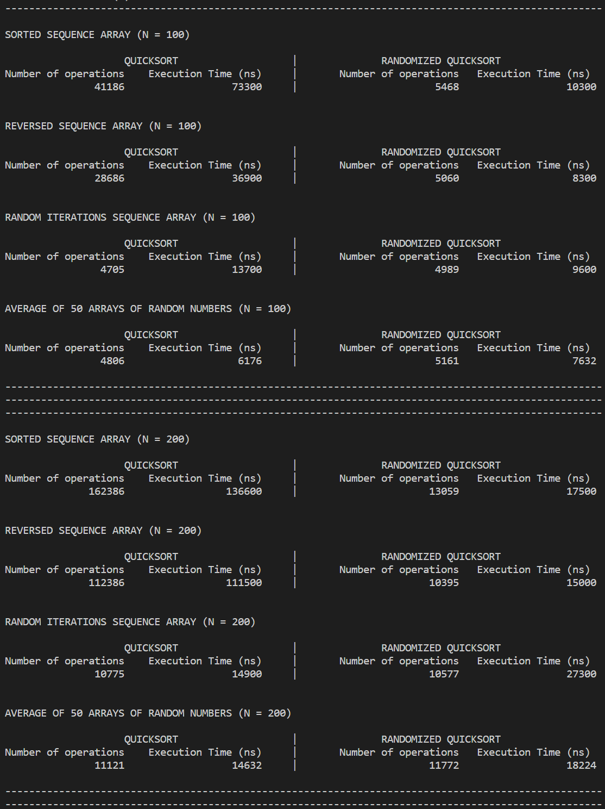
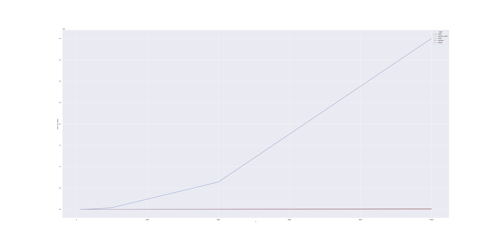
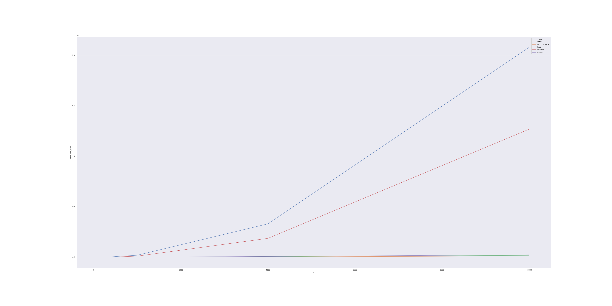
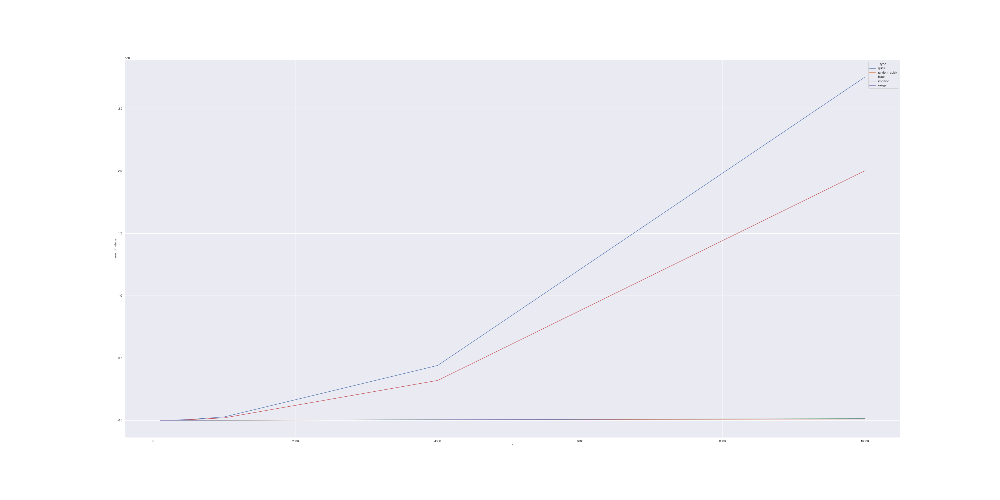
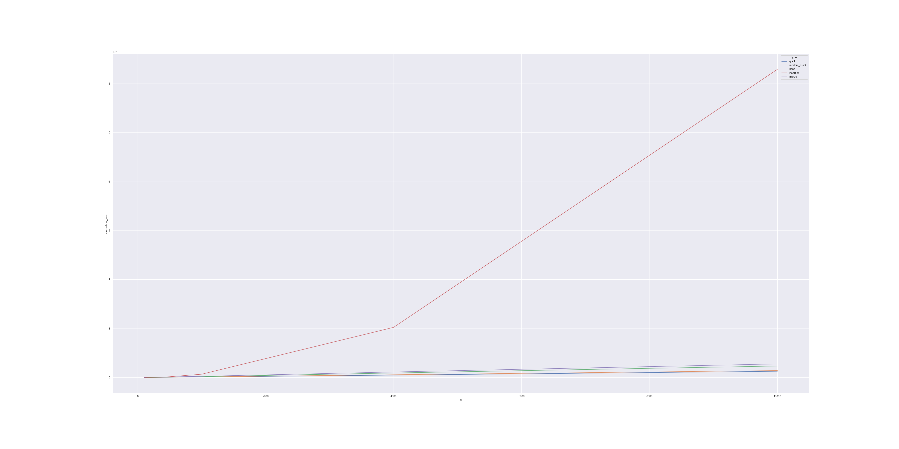
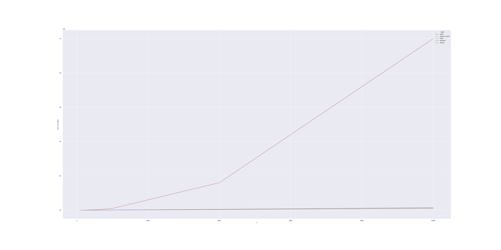

# Testing Algorithms - *Heap Sort & Insertion Sort & Merge Sort*

This program was written for **CSC 382 Algorithms** class at **College of Staten Island (CUNY)**

Created by: **Konstantin Novichenko**

## Overview

The program implements *Heap Sort*, *Insertion Sort*, and *Merge Sort Algorithms* and checks their efficiency for arrays of size **N = 100, 200, 300, 400, 500, 1000, 4000, 10000**
for the following test cases:
* Sorted Array
* Reversed Array
* Random Permunation of 1 to N Array
* 50 Random Instances of 1 to N (calculates average)

Efficiency is measured by execution time and the number of steps it took to sort the array.
User see the results of the sorting in a table format. The program outputs the results in .CSV file which is used for the data analysis. The .CSV file is being processed in jupyter notebook python script using Pandas and Seaborn. You can check the python script [here](./Data_Analysis.ipynb). Some of the graphs show very subtle difference between Heap Sort and Merge Sort. You can see the graphs of the subset **N = 100 to 500** [here](./Images/Zoomed_In_Graphs_Up_to_500/)

## Sample Output

Table with results

## Graphs

* Sorted Array - Execution Time

* Sorted Array - Steps

* Reversed Array - Execution Time

* Reversed Array - Steps

* Random Permutation Array - Execution Time

* Random Permutation Array - Steps

* Average of 50 Instances of Random Numbers - Execution Time

* Average of 50 Instances of Random Numbers - Steps

## Graphical Analysis of Data Sets
Uses Vernier Graphical Analysis to fit the curve and to find the approximate value of constant **C**. 

* Curve Fit for Heap Sort Data Set

The *Heap Sort* curve fit uses the equation: 
**C(x(log(x)))**, where **x** represents **N** and **C** is a constant.

## Author

2020, Konstantin Novichenko
